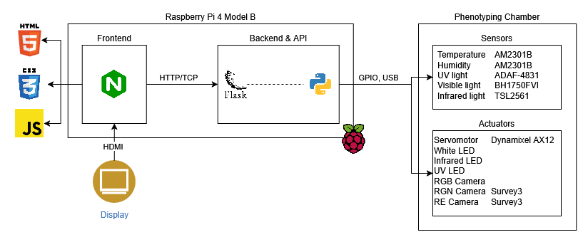
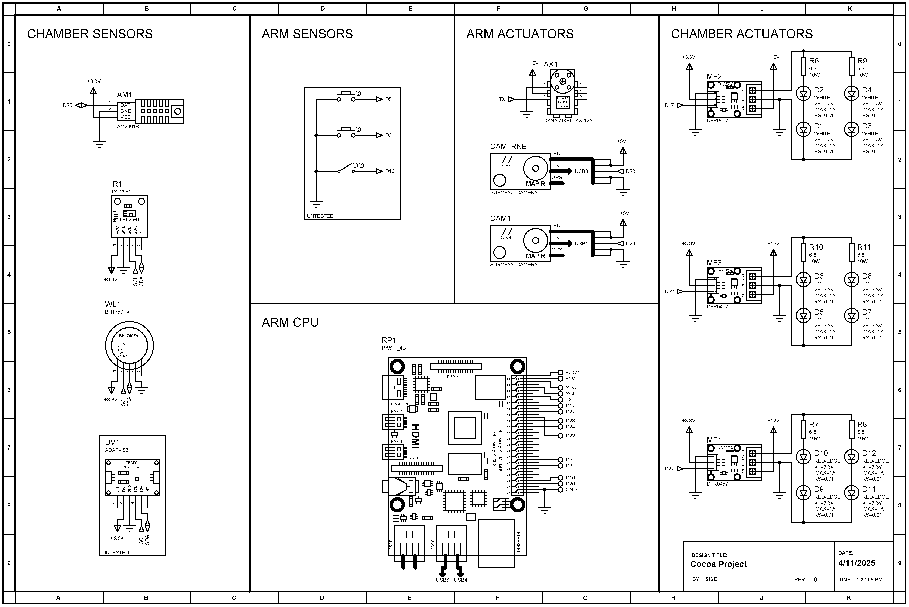

# ProyectoCacao2024

This project is a system for automated phenotyping of fruits and plants for 3D analysis making use of several sensors, multispectral cameras and visible light cameras. The project consists of two subsystems, the phenotyping chamber that sets the environment for the analysis and the robotic arm that orbits the cameras around the plant.

- **Phenotyping Chamber:** In charge of the environmental sensors and actuators. Receives the controls from the Robotic Arm's Raspberry Pi to interact with the components (e.g. Light sensors, Light actuators, Temperature, etc.)

- **Robotic Arm:** In charge of registering the plant in 3D by orbiting the cameras around it and controlling the environment. Sends the commands via a Raspberry Pi 4 Model B, rotates using a Dynamixel AX-12 and is equipped with multispectral Survey3 cameras.

The system has its own Dashboard that can be accessed locally by the raspberry from a screen that displays information about the sensors and actuators as well as a preview of the RGB camera as it orbits around the plant.

## Pre-requisites

- Python
- Docker

## Instalation

Enable I2C Interface and Serial Hardware on the Raspberry Pi

```
sudo raspi-config
```
```
Interface Options -> I2C -> Enable
Interface Options -> Serial Port -> (Serial shell) Disable -> (Serial hardware) Enable
```

Install package dependencies

```sh
sudo apt update && sudo apt upgrade -y
sudo apt install --no-install-recommends git build-essential libgl1 libglib2.0-0
rm -fr /var/lib/apt/lists/*
```

Clone the project and enter its root directory

```sh
git clone https://github.com/eggseal/camara-fenotipado.git
cd camara-fenotipado
```

Modify the environment variables to suit your device and preferences

```sh
cd ./python/chamber/
cp .env.example .env
nano .env
```

The project has the following variables

- `DASHBOARD_PORT` The port in which the dashboard frontend will be hosted
- `API_PORT` The port in which the API will be hosted

Then modify the frontend configuration file to match your `API_PORT`

```sh
nano ./frontend/config/nginx.conf
```

Search for the following line and modify the number after the `:`

```nginx
proxy_pass http://host.docker.internal:5000/;
```

Create and install the python environment

```sh
cd backend
python -m venv env
source env/bin/activate
pip install --upgrade pip setuptools
```

Install the external python library for the Dynamixel servo

```sh
git clone https://github.com/ROBOTIS-GIT/DynamixelSDK.git ./lib/dynamixel-sdk
cd ./lib/dynamixel-sdk/python
python setup.py install
cd ../../..
```

Install the rest of the requirements

```sh
pip install --no-cache-dir -r requirements.txt
cd ../../..
```

## Execution

Run the python API as a daemon

```sh
cd python/chamber/backend
source env/bin/activate
python main.py &
```

Build and run the Docker container for the frontend as a daemon

```sh
cd ..
docker compose up --build -d
```

## Components

The following tables lists all the components used in both the phenotyping chamber and the robotic arm systems.

### Phenotyping Chamber

| Tag         | Component                                                                            | Manufacturer        | Description                                  | Pin      | GPIO | Type |
| ----------- | ------------------------------------------------------------------------------------ | ------------------- | -------------------------------------------- | -------- | ---- | ---- |
| DHT_PIN     | [AM2301](https://www.haoyuelectronics.com/Attachment/AM2301/AM2301.pdf)              | ASAIR               | Digital temperature and humidity sensor      | 25       | 37   | IN   |
|             | [LTR390](https://cdn-learn.adafruit.com/downloads/pdf/adafruit-ltr390-uv-sensor.pdf) | Adafruit Industries | Ultraviolet light sensor board               | SDA, SCL | 3, 5 | I2C  |
|             | [BH1750FVI](https://www.mouser.com/datasheet/2/348/bh1750fvi-e-186247.pdf)           | ROHM Semiconductor  | Digital ambient light sensor IC              | SDA, SCL | 3, 5 | I2C  |
|             | [TSL2561](https://cdn-shop.adafruit.com/datasheets/TSL2561.pdf)                      | Adafruit Industries | Digital luminosity sensor for infrared light | SDA, SCL | 3, 5 | I2C  |
| WHITE_LIGHT | [White Power LED](https://www.wayjun.com/Datasheet/Led/3W%20High%20Power%20LED.pdf)  |                     | High power white colored LED                 | 17       | 11   | OUT  |
| IR_LIGHT    | [IR Power LED](https://www.led1.de/shop/files/Datenblaetter/PowerLEDs/WEPIR3-S2.pdf) |                     | High power infrared LED                      | 27       | 13   | OUT  |
| UV_LIGHT    | [UV Power LED](https://www.lc-led.com/products/lce-557uv365p.html)                   |                     | High power ultraviolet LED                   | 22       | 15   | OUT  |

### Robotic Arm

| Tag        | Component                                                                             | Manufacturer | Description                                          | Pin     | GPIO | Type     |
| ---------- | ------------------------------------------------------------------------------------- | ------------ | ---------------------------------------------------- | ------- | ---- | -------- |
|            | [Dynamixel AX-12](https://emanual.robotis.com/docs/en/dxl/ax/ax-12a/)                 | ROBOTIS      | Smart actuator with fully integrated DC Servo module | TX      | 8    | UART     |
|            | RGB Camera                                                                            |              | RGB Camera for visible light                         | USB     |      | USB      |
| RGN_CAMERA | [Survey3 RGN](https://drive.google.com/file/d/10gIzOjWVNoG9dvZwmAUG9fVqkEZHXEur/view) | MAPIR        | Survey camera for Red, Green and Near-Infrared       | 24, USB | 18   | OUT, USB |
| RE_CAMERA  | [Survey3 RE](https://drive.google.com/file/d/10gIzOjWVNoG9dvZwmAUG9fVqkEZHXEur/view)  | MAPIR        | Survey camera for Red-Edge                           | 23, USB | 16   | OUT, USB |
| START_BTN  | Button                                                                                |              | Generic button for single pulse input                | 5       | 29   | IN       |
| STOP_BTN   | Button                                                                                |              | Generic button for single pulse input                | 6       | 31   | IN       |
| DIR_SWITCH | Switch                                                                                |              | Generic switch for continous input                   |         |      | IN       |

## Architecture



## Schematic


